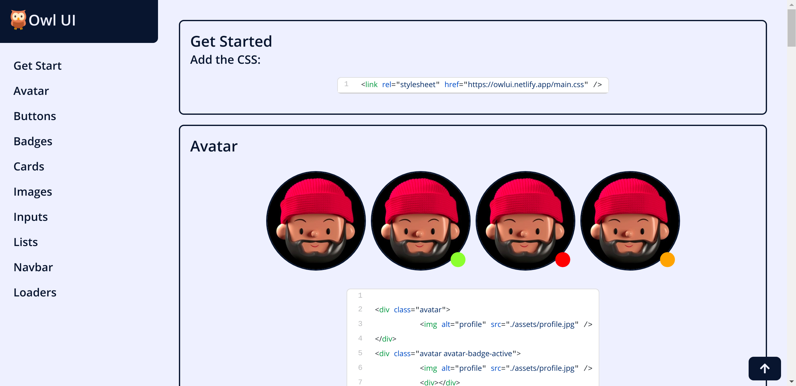

# OWL UI

A fast and efficient CSS Library that works! Now zoom past those CSS troubles

## Features

Custom CSS resuable components for quickly styling up your Web applications!

- Avatars
- Avatars with status badges
- Buttons
- Badges
- Multiple Cards
- Responsive Images
- Inputs Components
- Links
- Lists
- Loaders
- Modals
- Navigation Bar
